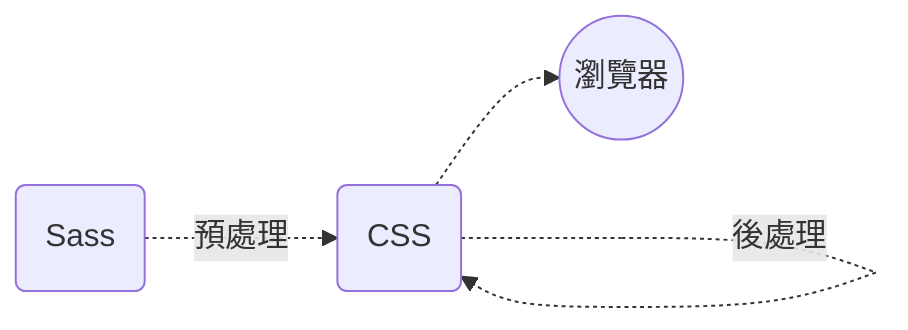

## 前言

在上一篇文章中[那些發生在 CSS 之「前」的魔法 —— 預處理器](https://www.tridong.com/post/tutorial/the-magic-before-css-preprocessors/)，我們探討了 CSS 預處理器，並了解為什麼需要使用「 CSS 處理器」。這次讓我們來了解後處理器，特別是 _PostCSS_ 能夠為你幫上什麼忙！文章主要會探討以下幾個重點 (附帶範例)：

-   ✔️ 提供什麼好處、為什麼需要它們？
-   🔎 有哪些後處理器可以選擇？
-   ❌ 或許不應該使用後處理器的原因

以下是關係圖表，在開始之前可以回顧一下後處理器的位置。

## 使用後處理器的理由？

後處理器會把現有的 CSS 檔案解析後處理，實現某些功能。例如自動添加 Vendor Prefix ([Prefixfree](https://projects.verou.me/prefixfree/))或使用最新的語法([Stylecow](https://stylecow.github.io/))。不過隨著 [Vendor Prefix 的式微](https://css-tricks.com/is-vendor-prefixing-dead/) 在 2022 的現今也很少有要用後處理器的需求了。

## 有哪些後處理器可以選擇？

最常聽見的 PostCSS 可以是後處理器也可以是預處理器，是個絕大多數人都在用的工具。其他工具基本上在現今都沒有必要了……

## PostCSS — 借助 Javascript 之力處理 CSS

[PostCSS](https://postcss.org/) 幾乎是後處理器的代名詞，不過實際上這個名詞並不太準確，因為它實際上可以預處理，也能後處理。這樣尷尬矛盾的命名他們團隊 [Twitter 上也提到過](https://twitter.com/PostCSS/status/626046993006239744) 。

簡單來說，PostCSS 讓你用 Javascript 插件*自動化處理你的 CSS*，只要想得到的功能，都能在 PostCSS 插件庫([PostCSS.part](https://www.postcss.parts/))中找得到，舉例來說：

-   用全新的方式撰寫 CSS ([Tailwind CSS](https://tailwindcss.com/docs/installation/using-postcss))
-   壓縮現有檔案 ([CSSnano](https://cssnano.co/))
-   自動添加 Vendor Prefix ([Autoprefixer](https://github.com/postcss/autoprefixer))
-   立即使用最新出爐的語法 ([postcss-preset-env](https://preset-env.cssdb.org/))
-   提醒語法上的錯誤並修正 ([Stylelint](https://stylelint.io/))

### 那麼 PostCSS 和其他 CSS 處理器比起來差在哪裡？

-   壓倒性的使用率與好感 ([State of CSS 2021 Pre-/Post-processors](https://2021.stateofcss.com/en-US/technologies/pre-post-processors))。
-   本身沒有任何功能，但可以安裝各式各樣社群開發的插件來擴充。
-   能安裝、去除自己想要的功能，更快的建構時間。
-   風氣自由，可以自行開發插件上傳社群。

## 最後，為什麼你可能不需要預處理器

解釋完了預處理器的好處，也要了解什麼場合，你不應該用它。

### 非原生

說到底預處理器的功能仍是社群自行開發製作的，一個專案新增多餘的依賴 (Dependency) 並不是一件好事；而非原生的代碼可能在某一天就被原生所取代了，代表可能*未來某一天某些預處理器提供的功能被趕上，你可能需要再重寫一遍*。

### 更高層級的抽象

處理器幫助你施作 CSS 在一個更高的抽象級別，可能不了解的人需要花費成本來去維護你的代碼，營造一個*更複雜的開發環境，投入額外的時間成本學習*。

### 專案沒有很大

使用以上這些功能還需要安裝配置與學習，不如直接開始寫 CSS 就好。

## 結語

最終，要不要使用預處理器？要使用哪一款？關係到團隊與個人的偏好或專案的規模來決定，精進 CSS，不管哪款預處理器都能樣樣通。

## 參考資料

-   [CSS Post-Processors For Beginners: Tips and Resources](https://www.hongkiat.com/blog/css-post-processors-tips-resources/)
-   [PostCSS in 100 Seconds](https://www.youtube.com/watch?v=WhCXiEwdU1A)
