## 前言

在前端開發領域，常常會聽見的一些預處理器 (Pre-processor)，像是 Sass、less、stylus，是什麼？為什麼存在？這篇文章主要會探討以下幾個重點 (附帶範例)：

* 🤔 CSS 處理器是什麼？
* ✔️ 提供什麼好處、為什麼需要它們？
* 🔎 有哪些預處理器可以選擇？
* ❌ 或許不應該使用預處理器的原因
## 什麼是 CSS 處理器？


在今天，撰寫存在於未來的 CSS


「CSS 處理器」的存在，其實主要就是為了彌補 CSS 開發上功能不盡理想的地方。在早期，並沒有複雜的邏輯與功能去撰寫可重複使用與好被管理的代碼，造成開發者們碰到了 *難管理、難擴增* 的難題，特別是在大型的專案事態變得更加混亂，於是出現了 CSS 處理器用於解決這樣的問題。 

```mermaid
flowchart LR
  A(Sass) -.預處理 .-> B(CSS) -.後處理 .-> B(CSS) .-> C((瀏覽器))
```



藉由*預處理器延伸 CSS 的功能和語法*來實現更為複雜的邏輯與更簡潔的代碼，例如 Variables、Functions、Mixins、Code Nesting……等，實踐 [DRY](https://zh.wikipedia.org/zh-tw/%E4%B8%80%E6%AC%A1%E4%B8%94%E4%BB%85%E4%B8%80%E6%AC%A1) 原則。

抑或是使用*後處理器對現有的 CSS 做處理*，來壓縮、修飾、更動現有的 CSS，例如 Import、Minification、Autoprefixer、CSS Nano……等

在本篇文章中，主要探討*預處理器*的環節，後處理器可以參考筆者的另一篇文章：[那些發生在 CSS 之「後」的魔法 —— 後處理器 ](https://www.tridong.com/post/tutorial/the-magic-after-css-postprocessors/)

## 使用預處理器的理由


使撰寫 CSS 充滿可能性！


* 寫巢狀 CSS 不用一直重複名稱 (Nesting)
* 可以不用再把所有的代碼都擠在一個檔案內 (Modules/mixin)
* 可以使用變數與運算符號 (Variables/Operators)
* 可以不用一直重複寫相同重複的代碼 (Extend/Inheritance)

總結來說，*預處理器幫助我們更好的撰寫 CSS*，撰寫預處理器語言(可以想像成是撰寫富含[語法糖](https://zh.wikipedia.org/zh-tw/%E8%AF%AD%E6%B3%95%E7%B3%96)的 CSS)再使用預處理器將它編譯為 CSS。

當然了，瀏覽器依舊還是只認得 CSS ，並不了解任何預處理器語言的語法。因此需要在使用時將預處理器的語法「預」處理為 CSS 來使用，儘管各種預處理器有自己定義的邏輯和語法，*最終*仍都是被轉譯為 CSS。

## Sass — Syntactically Awesome Style Sheets 廣受歡迎的預處理器
Sass 是目前最多人使用的預處理器([State of CSS 2021](https://2021.stateofcss.com/en-US/technologies/pre-post-processors))，同時也是最早出現的預處理器。有著廣大的社群和學習資源，是一款成熟穩定、充滿威力的預處理器。原先撰寫於 Ruby 語言，現今[官方推薦使用全新的 Dart Sass](https://sass-lang.com/ruby-sass)。

*撰寫 Sass 的語法有兩種 —— SASS 或 SCSS*，其中 SCSS 更貼近 CSS 的樣子，使用括弧與分號來嵌套語句，*和規的 CSS 也意味著是和規的 SCSS 語法*。

我個人更喜歡外貌上簡潔的 SASS，如果你特別厭煩寫 CSS 要打一堆 ```{}``` 與 ```;``` 就選擇 SASS 吧！除此之外*僅為撰寫上的習慣不同，它們依舊還是相同的東西*。

如果還是不清楚的話，底下章節會*以 Sass 作為預處理器的範例*，解釋它提供的解決方案。

### Nesting 巢狀

撰寫 CSS 是一件累人的事，要一遍又一遍的重複選取同樣的東西……？

<div class="grid grid-cols-1 md:grid-cols-2">

``` css
nav ul {
  margin: 0;
  padding: 0;
  list-style: none; }

nav li {
  display: inline-block; }

nav a {
  display: block;
  padding: 6px 12px;
  text-decoration: none; }
}
```

``` sass
nav
  ul
    margin: 0
    padding: 0
    list-style: none

  li
    display: inline-block

  a
    display: block
    padding: 6px 12px
    text-decoration: none
```
</div>

有了 Sass 能夠避免撰寫重複的東西，讓代碼更簡潔明瞭更好維護。

### Modules 模組

把 CSS 都寫在單一檔案內，避免使用 [CSS @import](https://developer.mozilla.org/en-US/docs/Web/CSS/@import)，藉此來減少 Http Request ，但只要檔案一複雜，根本很難規劃……


``` sass
// Base
@import ./base/reset
@import ./base/variable

// Components
@import ./components/btn
@import ./components/alert
@import ./components/navbar

```
免擔心！在預處理時，幫助你打包所有 css 檔案，免除管理組件上的問題。
### Mixins 混入

一群差不多樣式的元件，一直重複寫同樣的東西……


<div class="grid grid-cols-1 md:grid-cols-2">

``` Sass
@mixin theme($theme: gray)
  background: $theme
  color: #fff

.info
  @include theme

.alert
  @include theme($theme: red)

.success
  @include theme($theme: green)
```

``` Css
.info
  background: gray
  color: #fff

.alert
  background: red
  color: #fff

.success
  background: green
  color: #fff
```

</div>

有相似的組件一直重複寫讓你感覺很蠢？寫一次就好。

### Extend/Inheritance


一群差不多外觀的組件要一直複製貼上……


``` Sass
%message-shared
  border: 1px solid #ccc
  padding: 10px
  color: #333

.message
  @extend %message-shared

.success
  @extend %message-shared
  border-color: green

.error
  @extend %message-shared
  border-color: red

.warning
  @extend %message-shared
  border-color: yellow
```
有相似的組件一直重複寫讓你感覺很蠢？寫一次就好。。

## LESS — Leaner Style Sheets
LESS 是一款撰寫於 Javascript 的預處理器，無疑是 Sass 主要的競爭對手，提供了。不過自從 Bootstrap 於第四版更換它們的預處理器為 Sass 後就較少人使用了。

## Stylus
Stylus 是一款撰寫於 Node JS 的預處理器，更小眾，使用的人比例更少，不過偶而還是會出現因此在這裡標註一下。
## 最後，為什麼你可能不需要預處理器
解釋完了預處理器的好處，也要了解什麼場合，你不應該用它。
### 非原生
前端開發的世界一直在變換，一個專案新增多餘的依賴 (Dependency) 並不是一件好事；而非原生的代碼可能在某一天就被原生所取代了，代表可能*未來某一天某些預處理器提供的功能被趕上，你可能需要再重寫一遍*。
### 更高層級的抽象
處理器幫助你施作 CSS 在一個更高的抽象級別，可能不了解的人需要花費成本來去維護你的代碼，營造一個*更複雜的開發環境，投入額外的時間成本學習*。
### 專案沒有很大
新增檔案，直接開始進入正事不好嗎？搞一大堆花里胡俏的東西在小專案省不了太多時間。純 CSS 多香阿？
## 結語
最終，要不要使用預處理器？要使用哪一款？關係到團隊與個人的偏好或專案的規模來決定，精進 CSS，不管哪款預處理器都能樣樣通。


## 參考資料
* [mdn CSS Preprocessor](https://developer.mozilla.org/en-US/docs/Glossary/CSS_preprocessor)
* [State of CSS](https://2021.stateofcss.com)
* [CSS Preprocessors – Sass vs LESS vs Stylus (With Examples)](https://www.lambdatest.com/blog/css-preprocessors-sass-vs-less-vs-stylus-with-examples/)
* [CSS is dead, long live CSS](https://www.youtube.com/watch?v=jWDZP8twWDg)
* [What's the difference between SCSS and Sass?](https://stackoverflow.com/questions/5654447/whats-the-difference-between-scss-and-sass)
* [Deconfusing Pre- and Post-processing](https://medium.com/@ddprrt/deconfusing-pre-and-post-processing-d68e3bd078a3)